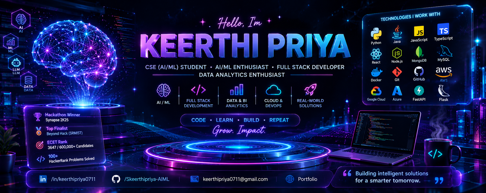

<!-- ========================================================= -->

<!--                    PROFILE BANNER                         -->

<!-- ========================================================= -->

<p align="center">
  
</p>

<h1 align="center">Hi 👋, I'm Keerthi Priya</h1>

<h3 align="center">
  CSE (AI/ML) Student • AI/ML Enthusiast • Full Stack Developer • Data Analytics Enthusiast
</h3>

<p align="center">
  <em>
    Building intelligent applications, solving real-world problems,
    and continuously learning emerging technologies.
  </em>
</p>

<p align="center">
  <a href="https://www.linkedin.com/in/keerthipriya0711/">
    
  </a>
  <a href="https://github.com/Skeerthipriya-AIML">
    
  </a>
  <a href="https://www.hackerrank.com/">
    
  </a>
</p>

---

# 👩‍💻 About Me

I'm a **Computer Science student specializing in Artificial Intelligence & Machine Learning**, passionate about turning ideas into practical software and intelligent solutions.

I enjoy working across the complete development lifecycle — from **AI/ML experimentation and data analysis to backend APIs, databases, frontend development, and deployment**.

* 🎓 B.Tech in **Computer Science & AI/ML**
* 🤖 Interested in **Artificial Intelligence, Machine Learning & Generative AI**
* 🧠 Exploring **LLMs, RAG and AI-powered applications**
* 💻 Building applications with **React, Node.js, TypeScript & Python**
* 📊 Interested in **Data Analytics, SQL & Business Intelligence**
* ☁️ Exploring **AWS, Azure & cloud technologies**
* 🏆 Hackathon Winner & National-Level Hackathon Finalist
* 💡 Strong foundation in **DSA, DBMS, OOP & System Design**

---

# 🚀 What I Build

```text
              ┌─────────────────────────┐
              │     Artificial          │
              │   Intelligence / ML     │
              └────────────┬────────────┘
                           │
              ┌────────────▼────────────┐
              │   Generative AI / LLMs  │
              │       RAG / AI Apps     │
              └────────────┬────────────┘
                           │
         ┌─────────────────┼─────────────────┐
         ▼                 ▼                 ▼
   Full Stack          Data & BI          Cloud
   Development         Analytics        Deployment
         │                 │                 │
         └─────────────────┼─────────────────┘
                           ▼
                🌍 Real-World Solutions
```

---

# 🔥 Featured Projects

## 🤖 AI Career Assistant — Generative AI Platform

> A full-stack Generative AI platform for AI-powered career assistance, resume intelligence and personalized coaching.

### ✨ Key Features

* 🤖 AI-powered chat and career coaching
* 📄 AI resume analysis
* 🎯 ATS resume scoring
* 🧠 RAG-based AI functionality
* 📚 Document intelligence
* ⚙️ Task automation
* 🔐 JWT authentication
* 🗄️ MongoDB database integration
* 🐳 Docker-based containerization

### 🛠️ Tech Stack

`React.js` `TypeScript` `FastAPI` `Python` `MongoDB` `REST APIs` `RAG` `JWT` `Docker`

---

## 🌱 AgroSense AI — Smart Farming Dashboard

> An AI-powered smart farming platform designed to help monitor agricultural conditions and support data-driven farming decisions.

### ✨ Key Features

* 🌾 Real-time field monitoring
* 🌦️ Weather forecasting
* 🧠 AI-based crop disease detection
* 🌱 Disease detection for **20+ crops**
* 📊 Smart farming dashboard

### 🛠️ Tech Stack

`React.js` `Node.js` `Python` `Machine Learning` `MongoDB` `Flask`

---

## 🧑‍🏫 SparkMinds — AI Learning Management System

> An AI-powered LMS designed to create a smarter and more personalized learning experience.

### ✨ Key Features

* 👨‍🏫 Student & teacher role-based dashboards
* 📊 Performance tracking
* 🤖 Google Gemini AI chatbot
* 🧭 AI-powered Skill Path Generator
* 📝 Assignment and learning workflows

### 🛠️ Tech Stack

`React.js` `Node.js` `Express.js` `MongoDB` `REST APIs` `Gemini API` `Git/GitHub`

🏆 **Hackathon Winner — Synapse 2K25**

---

# 💼 Experience

### 💻 Full Stack Developer Intern

**AatonovaZ Technologies Private Limited**

`03/2026 – 09/2026`

* Developed and enhanced **MeetFlow**, a full-stack project management application.
* Built application features using **React.js, TypeScript, Node.js, Express.js and MongoDB**.
* Developed and integrated REST APIs across frontend, backend and database layers.
* Translated application requirements into technical features and workflows.
* Troubleshot application issues and implemented fixes to improve reliability.
* Collaborated on development, testing, debugging and Git/GitHub workflows.

---

### 📊 Data Analyst Intern

**Wipro Infrastructure Engineering Private Limited**

`07/2023 – 11/2023`

* Analyzed business data using **Microsoft Excel**.
* Created structured PowerPoint reports supporting organizational decision-making.
* Developed experience in analytical problem-solving, business communication and reporting.
* Communicated insights in a structured and stakeholder-focused manner.

---

# 🛠️ Tech Stack

### 👨‍💻 Programming Languages

<p>

</p>

`Python` `Core Java` `SQL` `JavaScript` `TypeScript` `HTML` `CSS`

---

### 🤖 AI / Machine Learning

<p>

</p>

`Machine Learning` `Deep Learning` `LLMs` `Generative AI` `RAG` `Pandas` `NumPy`

---

### 🌐 Full Stack Development

<p>

</p>

`React.js` `Node.js` `Express.js` `FastAPI` `Flask` `REST APIs` `API Integration`

---

### 🗄️ Databases

<p>

</p>

`MongoDB` `MySQL` `RDBMS` `NoSQL`

---

### ☁️ Cloud & Tools

<p>

</p>

`AWS` `Azure` `Docker` `Git` `GitHub` `Postman` `Jupyter Notebook` `Google Colab` `ServiceNow`

---

# 🏆 Certifications & Achievements

### ☁️ Certifications

* 🏅 **AWS Certified Cloud Practitioner — 2026**
* 🤖 **AWS Certified Machine Learning Engineer – Associate — 2026**
* 🧠 **IBM Supervised Machine Learning Certification**
* ⚙️ **ServiceNow Virtual Internship Program — 2026**

---

### 🥇 Hackathons

🏆 **Hackathon Winner — Synapse 2K25**

Built **SparkMinds — AI Learning Management System**

🏅 **Top Finalist — Beyond Hack**

National-level hackathon hosted by **SRMIST**

---

### 🎯 Academic Achievement

**ECET Rank — 3647**

Secured **AIR 3647 among approximately 600,000 candidates**.

---

### 💻 Problem Solving

* 🧩 **100+ HackerRank problems solved**
* 💡 Practicing Data Structures & Algorithms
* 🧠 Strong foundation in DBMS, OOP and problem solving

---

# 📈 GitHub Statistics

<p align="center">
  
  
</p>

---

# 🔥 GitHub Streak

<p align="center">
  
</p>

---

# 📊 My Development Journey

```text
2023
 │
 ├── Data Analysis
 │
 ▼
2024
 │
 ├── Computer Science & AI/ML
 ├── Programming
 └── Full Stack Foundations
 │
 ▼
2025
 │
 ├── AI Applications
 ├── Hackathons
 ├── SparkMinds
 └── Machine Learning
 │
 ▼
2026
 │
 ├── Generative AI
 ├── RAG & LLM Applications
 ├── AI Career Assistant
 ├── Cloud & DevOps
 └── Full Stack Engineering
 │
 ▼
🚀 Next → Production-Ready AI Systems
```

---

# 📚 Currently Learning

<table>
<tr>
<td align="center">🤖<br><b>Generative AI</b></td>
<td align="center">🧠<br><b>Machine Learning</b></td>
<td align="center">🔗<br><b>RAG & LLMs</b></td>
<td align="center">💻<br><b>Full Stack</b></td>
</tr>
<tr>
<td align="center">📊<br><b>Data Analytics</b></td>
<td align="center">☁️<br><b>Cloud</b></td>
<td align="center">⚙️<br><b>APIs</b></td>
<td align="center">🧩<br><b>DSA</b></td>
</tr>
</table>

---

# 🎯 2026 Mission

> **Build intelligent systems that solve real problems — from idea to production.**

```text
Learn → Experiment → Build → Deploy → Improve → Repeat
```

---

# 🌐 Let's Connect

<p align="center">

<a href="https://www.linkedin.com/in/keerthipriya0711/">

</a>

<a href="https://github.com/Skeerthipriya-AIML">

</a>

</p>

---

<p align="center">

### 💜 Code. Learn. Build. Repeat. Grow. Impact.

⭐ **Thanks for visiting my profile!**

</p>
